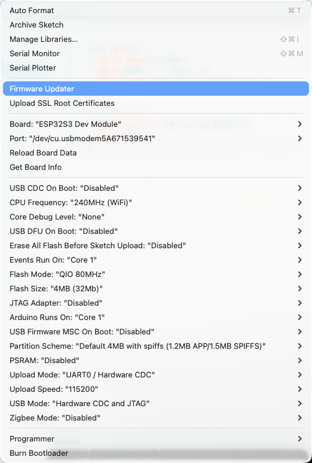

# 我本来准备使用串口调试，但是串口一直没有输出
## 查询原因是因为我们在Arduino 里面的一些设置问题
正确设置如下图：在 Arduino->tool 里面的设置成下图

os:这个 Arduino，虽然我们使用的是 ESP32-S3-WROOM-1，但是选择板的时候还是要选择 ESP32S3 Dev Module🤦‍♂️
[serialDebug](./SerialProblem/serial.ino) 
在我的 mac 电脑上上使用 screen 监视发现 1s 输出一次 hello world 证明串口成功通信

调试完这个小插曲之后我们再进行下一步测试
[micro_ros5](./micro_ros5.md)
