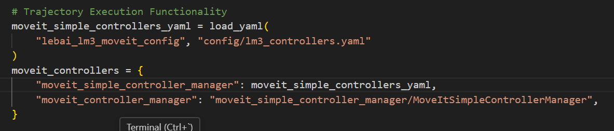

# 这个记载了乐白机器人的一些运行问题
注意不要乱更新第三方库，这里给的建议是可以通过虚拟环境来解决这个问题
## 1.机器人驱动没有找到
```bash
ros2 launch  lebai_lm3_moveit_config  lm3.launch.py robot_ip:=192.168.0.50
```
[move_group-7] [ERROR] [1766028039.513382705] [moveit.simple_controller_manager.follow_joint_trajectory_controller_handle]: Action client not connected to action server: lebai_trajectory_controller
[move_group-7] [ERROR] [1766028039.513404081] [moveit_ros.trajectory_execution_manager]: Failed to send trajectory part 1 of 1 to controller lebai_trajectory_controller
[move_group-7] [INFO] [1766028039.513418545] [moveit_ros.trajectory_execution_manager]: Completed trajectory execution with status ABORTED ...
[move_group-7] [INFO] [1766028039.513634709] [moveit_move_group_default_capabilities.execute_trajectory_action_capability]: Execution completed: ABORTED
[rviz2-9] [INFO] [1766028039.514178080] [move_group_interface]: Execute request aborted
[rviz2-9] [ERROR] [1766028039.514498470] [move_group_interface]: MoveGroupInterface::execute() failed or timeout reached
### 解决方案
- 运行机器人驱动程序 lebai-ros-sdk-humble-dev/lebai_driver
在lebai_driver目录下面,检查一下机器人状态,这个目录下运行都需要加上robot_ip:=192.168.0.50
```bash
    # 检查机器人状态
    ros2 launch lebai_driver robot_state.launch.py robot_ip:=192.168.0.50
```
机器人状态没有问题
检查机器人的接口文件有没有问题
```bash
    ros2 launch lebai_friver robot_interfaces.launch.py robot_ip:=192.168.0.50
```
运行的时候出现新版本的numpy库不兼容np.float()这个用法。
```bash
    pip3 uninstall numpy
    pip3 install numpy==1.23.5
```
运行发现机器人的接口也没有问题
```bash
    ros2 action list 
```
输出这个
```bash
    /lebai_trajectory_cxontroller
```
对应我们的第一个错误
现在再运行发现我们使用的rviz里面出现这个需要好几次才可以成功运行到我们需要它运动的位置
终端输出有异常取消这个为啥呀？
在这个机器人的robot_interfaces.launch.py中输出的
```bash
[motion-4] [INFO] [1766034749.702389715] [trajectory_action_server]: Lebai trajectory executing trajectory..
[motion-4] [INFO] [1766034749.703768581] [trajectory_action_server]: Sending trajectory start.
# 我并没有手动取消为啥这个上面显示我发出来取消请求
[motion-4] [INFO] [1766034753.220689077] [trajectory_action_server]: Lebai trajectory received cancel request
[motion-4] [INFO] [1766034753.337184677] [trajectory_action_server]: Sending trajectory abort.
[motion-4] [INFO] [1766034753.338525653] [trajectory_action_server]: Wait for trajectory execution finished...
[motion-4] [INFO] [1766034754.577612137] [trajectory_action_server]: Lebai trajectory execution canceled.
[motion-4] [INFO] [1766034758.156795079] [trajectory_action_server]: Lebai trajectory received goal request. points size: 21
[motion-4] [INFO] [1766034758.162438095] [trajectory_action_server]: Lebai trajectory executing trajectory..
# 多次运行之后会输出成功，在路径规划的时候rviz里面也显示正确
[motion-4] [INFO] [1766034758.163896067] [trajectory_action_server]: Sending trajectory start.
[motion-4] [INFO] [1766034762.056481081] [trajectory_action_server]: Sending trajectory finished.
[motion-4] [INFO] [1766034762.057314103] [trajectory_action_server]: Wait for trajectory execution finished...
[motion-4] [INFO] [1766034769.375396995] [trajectory_action_server]: Lebai trajectory execution finished.
```
修改moveit的配置文件在运行的launch文件里面找moveit_controllers这个指向的是moveit_simple_controllers_yaml


```
find . -name "moveit_simple_controller_yaml"
```
发现并没有这个配置文件呀
问Gemini之后修改了"trajectory_execution.allowed_goal_duration_margin": 0.5->2.0和"trajectory_execution.allowed_execution_duration_scaling": 1.2 ->3.0

[ConfigLaunch](/home/dxf/wheeltec_lebai_humble_2024_7_17/src/lebai-ros-sdk-humble-dev/lebai_lm3_moveit_config/launch/lm3.launch.py)

```bash
    colcon build --packages-select lebai_lm3_moveit_con fig
    source ./install/setup.bash
    ros2 launch lebai_lm3_moveit_config lm3,launch.py
```
现在这个可以在rviz里面操作机器人让它运动
下面是演示视频

<video src="./videos/demo.mp4" controls width="800"></video>


