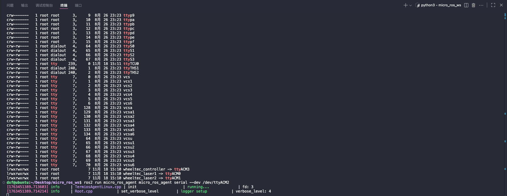
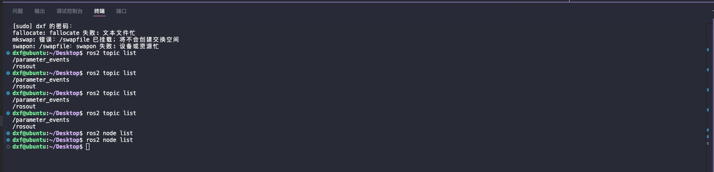

# 1.使用platformio平台(更底层可以有所了解这个平台)
## 克隆platformio
    git clone https://github.com/micro-ROS/micro_ros_platformio.git
## 在vscode里面下载platformio,并且创建一个新工程
## 这里我们使用的是ESP32-S3-N16-R8芯片
所以在platformio.ini里面的配置如下选择芯片是选择esp32-s3-devkitc-1
# 2.使用Arduino平台本项目主要是通过 Arduino 平台开发
参考链接:
<https://www.hackster.io/514301/micro-ros-on-esp32-using-arduino-ide-1360ca#toc-system-specification-0>
## 使用板子这里直接有esp32提供给我们的板子esp32-s3-wroom1
库文件在这里下载:<https://github.com/micro-ROS/micro_ros_arduino/releases>
## 下载好了使用这个要看我们选择的端口ACM2要根据实际更改
    ros2 run micro_ros_agent micro_ros_agent serial --dev /dev/ttyACM2
## 终端显示如下证明连接成功

## 问题:但是我们发现这个ROS节点已经死掉了
    ros2 node list
这个结果是一个空的值这是为啥呀?


## 解决通过wifi连接
```cpp
    将set_microros_transports();改成:set_microros_wifi_transports(ssid, pass, agent_ip, agent_port);
```
## 下载出现问题
上传失败: 上传错误：exit status 2
    A serial exception error occurred: device reports readiness to read but returned no data (device disconnected or multiple access on port?)
    Note: This error originates from pySerial. It is likely not a problem with esptool, but with the hardware connection or drivers.
    For troubleshooting steps visit: https://docs.espressif.com/projects/esptool/en/latest/troubleshooting.html
## 使用 sudo lsof /dev/ttyACM2
检测端口是否被占用,如果输出如下


## 运行节点命令改成
    ros2 run micro_ros_agent micro_ros_agent udp4 --port 8888
## 再次测试


    ros2 topic echo /micro_ros_arduino_node_publisher 


现在证明这两个节点运行中
# 1.问题 platformio
VCSBaseException: VCS: Could not process command ['git', 'clone', '--recursive', '--depth', '1', 'https://github.com/micro-ROS/micro_ros_platformio', '/home/dxf/.platformio/.cache/tmp/pkg-installing-fjxmjuzt']
## 1.问题网络问题
    解决方案看VPN.md
# 2.问题 Arduino
micro_ros_arduino 库已声明为预编译：
在 “/home/dxf/Arduino/libraries/micro_ros_arduino-2.0.8-humble/src/esp32s3” 中找不到预编译库
/home/dxf/.arduino15/packages/esp32/tools/esp-x32/2507/bin/../lib/gcc/xtensa-esp-elf/14.2.0/../../../../xtensa-esp-elf/bin/ld: /tmp/arduino/sketches/0C62D527835CFB42B90FF6127BE90A18/sketch/micro-ros_publisher.ino.cpp.o:(.literal._Z14timer_callbackP11rcl_timer_sx+0x8): undefined reference to `rcl_publish'
/home/dxf/.arduino15/packages/esp32/tools/esp-x32/2507/bin/../lib/gcc/xtensa-esp-elf/14.2.0/../../../../xtensa-esp-elf/bin/ld: /tmp/arduino/sketches/0C62D527835CFB42B90FF6127BE90A18/sketch/micro-ros_publisher.ino.cpp.o:(.literal._Z5setupv+0x38): undefined reference to `rmw_uros_set_custom_transport'
/home/dxf/.arduino15/packages/esp32/tools/esp-x32/2507/bin/../lib/gcc/xtensa-esp-elf/14.2.0/../../../../xtensa-esp-elf/bin/ld: /tmp/arduino/sketches/0C62D527835CFB42B90FF6127BE90A18/sketch/micro-ros_publisher.ino.cpp.o:(.literal._Z5setupv+0x3c): undefined reference to `rcutils_get_default_allocator'
/home/dxf/.arduino15/packages/esp32/tools/esp-x32/2507/bin/../lib/gcc/xtensa-esp-elf/14.2.0/../../../../xtensa-esp-elf/bin/ld: /tmp/arduino/sketches/0C62D527835CFB42B90FF6127BE90A18/sketch/micro-ros_publisher.ino.cpp.o:(.literal._Z5setupv+0x44): undefined reference to `rclc_support_init'
/home/dxf/.arduino15/packages/esp32/tools/esp-x32/2507/bin/../lib/gcc/xtensa-esp-elf/14.2.0/../../../../xtensa-esp-elf/bin/ld: /tmp/arduino/sketches/0C62D527835CFB42B90FF6127BE90A18/sketch/micro-ros_publisher.ino.cpp.o:(.literal._Z5setupv+0x48): undefined reference to `rclc_node_init_default'
/home/dxf/.arduino15/packages/esp32/tools/esp-x32/2507/bin/../lib/gcc/xtensa-esp-elf/14.2.0/../../../../xtensa-esp-elf/bin/ld: /tmp/arduino/sketches/0C62D527835CFB42B90FF6127BE90A18/sketch/micro-ros_publisher.ino.cpp.o:(.literal._Z5setupv+0x4c): undefined reference to `rosidl_typesupport_c__get_message_type_support_handle__std_msgs__msg__Int32'
/home/dxf/.arduino15/packages/esp32/tools/esp-x32/2507/bin/../lib/gcc/xtensa-esp-elf/14.2.0/../../../../xtensa-esp-elf/bin/ld: /tmp/arduino/sketches/0C62D527835CFB42B90FF6127BE90A18/sketch/micro-ros_publisher.ino.cpp.o:(.literal._Z5setupv+0x50): undefined reference to `rclc_publisher_init_default'
/home/dxf/.arduino15/packages/esp32/tools/esp-x32/2507/bin/../lib/gcc/xtensa-esp-elf/14.2.0/../../../../xtensa-esp-elf/bin/ld: /tmp/arduino/sketches/0C62D527835CFB42B90FF6127BE90A18/sketch/micro-ros_publisher.ino.cpp.o:(.literal._Z5setupv+0x54): undefined reference to `rclc_timer_init_default'
/home/dxf/.arduino15/packages/esp32/tools/esp-x32/2507/bin/../lib/gcc/xtensa-esp-elf/14.2.0/../../../../xtensa-esp-elf/bin/ld: /tmp/arduino/sketches/0C62D527835CFB42B90FF6127BE90A18/sketch/micro-ros_publisher.ino.cpp.o:(.literal._Z5setupv+0x58): undefined reference to `rclc_executor_init'
/home/dxf/.arduino15/packages/esp32/tools/esp-x32/2507/bin/../lib/gcc/xtensa-esp-elf/14.2.0/../../../../xtensa-esp-elf/bin/ld: /tmp/arduino/sketches/0C62D527835CFB42B90FF6127BE90A18/sketch/micro-ros_publisher.ino.cpp.o:(.literal._Z5setupv+0x5c): undefined reference to `rclc_executor_add_timer'
/home/dxf/.arduino15/packages/esp32/tools/esp-x32/2507/bin/../lib/gcc/xtensa-esp-elf/14.2.0/../../../../xtensa-esp-elf/bin/ld: /tmp/arduino/sketches/0C62D527835CFB42B90FF6127BE90A18/sketch/micro-ros_publisher.ino.cpp.o:(.literal._Z4loopv+0x4): undefined reference to `rclc_executor_spin_some'
/home/dxf/.arduino15/packages/esp32/tools/esp-x32/2507/bin/../lib/gcc/xtensa-esp-elf/14.2.0/../../../../xtensa-esp-elf/bin/ld: /tmp/arduino/sketches/0C62D527835CFB42B90FF6127BE90A18/sketch/micro-ros_publisher.ino.cpp.o: in function `_Z14timer_callbackP11rcl_timer_sx':
/tmp/.arduinoIDE-unsaved20251018-17183-t47h86.43iz/micro-ros_publisher/micro-ros_publisher.ino:36:(.text._Z14timer_callbackP11rcl_timer_sx+0x10): undefined reference to `rcl_publish'
/home/dxf/.arduino15/packages/esp32/tools/esp-x32/2507/bin/../lib/gcc/xtensa-esp-elf/14.2.0/../../../../xtensa-esp-elf/bin/ld: /tmp/arduino/sketches/0C62D527835CFB42B90FF6127BE90A18/sketch/micro-ros_publisher.ino.cpp.o: in function `_Z5setupv':
/home/dxf/Arduino/libraries/micro_ros_arduino-2.0.8-humble/src/micro_ros_arduino.h:33:(.text._Z5setupv+0x13): undefined reference to `rmw_uros_set_custom_transport'
/home/dxf/.arduino15/packages/esp32/tools/esp-x32/2507/bin/../lib/gcc/xtensa-esp-elf/14.2.0/../../../../xtensa-esp-elf/bin/ld: /tmp/arduino/sketches/0C62D527835CFB42B90FF6127BE90A18/sketch/micro-ros_publisher.ino.cpp.o: in function `_Z5setupv':
/tmp/.arduinoIDE-unsaved20251018-17183-t47h86.43iz/micro-ros_publisher/micro-ros_publisher.ino:47:(.text._Z5setupv+0x32): undefined reference to `rcutils_get_default_allocator'
/home/dxf/.arduino15/packages/esp32/tools/esp-x32/2507/bin/../lib/gcc/xtensa-esp-elf/14.2.0/../../../../xtensa-esp-elf/bin/ld: /tmp/.arduinoIDE-unsaved20251018-17183-t47h86.43iz/micro-ros_publisher/micro-ros_publisher.ino:52:(.text._Z5setupv+0x50): undefined reference to `rclc_support_init'
/home/dxf/.arduino15/packages/esp32/tools/esp-x32/2507/bin/../lib/gcc/xtensa-esp-elf/14.2.0/../../../../xtensa-esp-elf/bin/ld: /tmp/.arduinoIDE-unsaved20251018-17183-t47h86.43iz/micro-ros_publisher/micro-ros_publisher.ino:52:(.text._Z5setupv+0x67): undefined reference to `rclc_node_init_default'
/home/dxf/.arduino15/packages/esp32/tools/esp-x32/2507/bin/../lib/gcc/xtensa-esp-elf/14.2.0/../../../../xtensa-esp-elf/bin/ld: /tmp/.arduinoIDE-unsaved20251018-17183-t47h86.43iz/micro-ros_publisher/micro-ros_publisher.ino:55:(.text._Z5setupv+0x70): undefined reference to `rosidl_typesupport_c__get_message_type_support_handle__std_msgs__msg__Int32'
/home/dxf/.arduino15/packages/esp32/tools/esp-x32/2507/bin/../lib/gcc/xtensa-esp-elf/14.2.0/../../../../xtensa-esp-elf/bin/ld: /tmp/.arduinoIDE-unsaved20251018-17183-t47h86.43iz/micro-ros_publisher/micro-ros_publisher.ino:58:(.text._Z5setupv+0x81): undefined reference to `rclc_publisher_init_default'
/home/dxf/.arduino15/packages/esp32/tools/esp-x32/2507/bin/../lib/gcc/xtensa-esp-elf/14.2.0/../../../../xtensa-esp-elf/bin/ld: /tmp/.arduinoIDE-unsaved20251018-17183-t47h86.43iz/micro-ros_publisher/micro-ros_publisher.ino:58:(.text._Z5setupv+0x97): undefined reference to `rclc_timer_init_default'
/home/dxf/.arduino15/packages/esp32/tools/esp-x32/2507/bin/../lib/gcc/xtensa-esp-elf/14.2.0/../../../../xtensa-esp-elf/bin/ld: /tmp/.arduinoIDE-unsaved20251018-17183-t47h86.43iz/micro-ros_publisher/micro-ros_publisher.ino:66:(.text._Z5setupv+0xab): undefined reference to `rclc_executor_init'
/home/dxf/.arduino15/packages/esp32/tools/esp-x32/2507/bin/../lib/gcc/xtensa-esp-elf/14.2.0/../../../../xtensa-esp-elf/bin/ld: /tmp/.arduinoIDE-unsaved20251018-17183-t47h86.43iz/micro-ros_publisher/micro-ros_publisher.ino:73:(.text._Z5setupv+0xba): undefined reference to `rclc_executor_add_timer'
/home/dxf/.arduino15/packages/esp32/tools/esp-x32/2507/bin/../lib/gcc/xtensa-esp-elf/14.2.0/../../../../xtensa-esp-elf/bin/ld: /tmp/arduino/sketches/0C62D527835CFB42B90FF6127BE90A18/sketch/micro-ros_publisher.ino.cpp.o: in function `_Z4loopv':
/tmp/.arduinoIDE-unsaved20251018-17183-t47h86.43iz/micro-ros_publisher/micro-ros_publisher.ino:81:(.text._Z4loopv+0x11): undefined reference to `rclc_executor_spin_some'
collect2: error: ld returned 1 exit status

exit status 1

Compilation error: exit status 1
## 原因:因为选择板子有误,并且需要把这个esp32改为esp32s3
micro_ros_arduino 库已声明为预编译：
在 /home/dxf/Arduino/libraries/micro_ros_arduino-2.0.8-humble/src/esp32s3 中使用预编译库
 项目使用 945359 字节（30%）的程序存储空间。最大值为 3145728 字节。
 个全局变量使用 64740 个字节（19%）的动态内存，剩下 262940 个字节用于局部变量。最大值为 327680 字节。
                                                                                
 Usage: esptool [OPTIONS] COMMAND [ARGS]...                                     
                                                                                
 Try 'esptool -h' for help                                                      
╭─ Error ──────────────────────────────────────────────────────────────────────╮
│ Invalid value for '--port' / '-p': Path '/dev/ttyACM3' is not readable.      │
╰──────────────────────────────────────────────────────────────────────────────╯
                                                                                
上传失败: 上传错误：exit status 2
## 原因:端口重启后发生变化
cp: 对 '/home/dxf/.arduino15/packages/esp32/hardware/esp32/3.3.3/tools/partitions/{build.partitions}.csv' 调用 stat 失败: 没有那个文件或目录
exit status 1
Compilation error: exit status 1
## 原因:选择板子错误选择成为esp32-s3-wroom2,因为没有看到wroom1🤦

dxf@ubuntu:~/Desktop/micro_ros_ws$ ros2 run micro_ros_agent micro_ros_agent udp4 --port 8888
[1763460303.964925] info     | UDPv4AgentLinux.cpp | init                     | running...             | port: 8888
[1763460303.965764] info     | Root.cpp           | set_verbose_level        | logger setup           | verbose_level: 4


