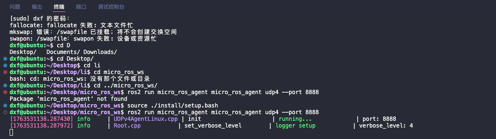
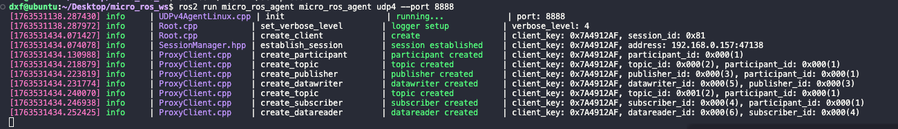
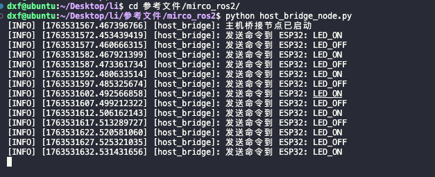
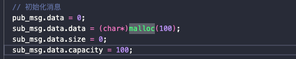
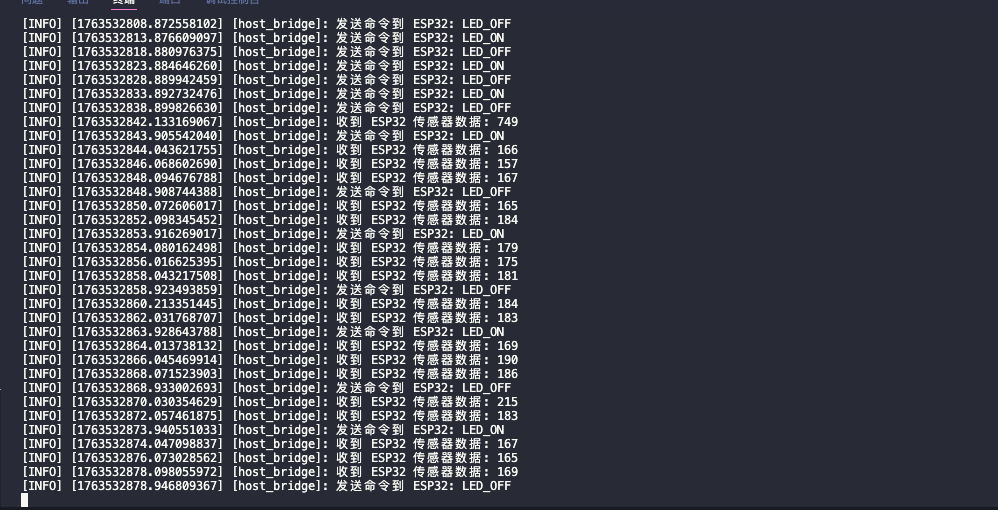

# 这里使用ESP32和那个ROS2之间互相通信
源码文件放在/home/dxf/Desktop/li/参考文件/mirco_ros2
分别为Arduino.cpp(放在Arduino中),host_bridge_node.py自己做一个python程序
## 1.把Arduino的代码下载到esp32中
## 2.在micro_ros2中启动micro-ROS Agent,因为使用的是Wi-Fi模式
    source ./install/setup.bash
    ros2 run micro_ros_agent micro_ros_agent udp4 --port 8888
出现这个界面

     然后需要拔一下这个电源,再插一下,出现这个界面,说明连接上了  

## 3.运行host_bridge_node.py
    python3 host_bridge_node.py
    出现这个界面,证明只有我们主机在给esp32发信息,但是没有收到esp32的回馈

### 为啥会出现这个问题
使用AI工具,让AI给我们写一个代码,放在LingmaArduino.cpp中 
AI分析的错因如下:

1.字符串消息初始化错误

在micro_ros中,手动分配内存不符合micro_ros的消息处理规范

2.缺少消息结构题的标准初始化
    
    std_msgs__msg__String__init(&sub_msg);  // 必须调用
    std_msgs__msg__Int32__init(&pub_msg);   // 建议调用

## 4.修改之后在下载到esp32中
发现修改之后可以连接上了esp32,并且可以正常通信,而且这次我并没有手动复位

自此就完成了esp32和主机之间互相通信.
## 5.总结
1.使用micro_ros的时候,要严格按照micro_ros的规范来写代码,不能改变结构体的内存分配方式

    

