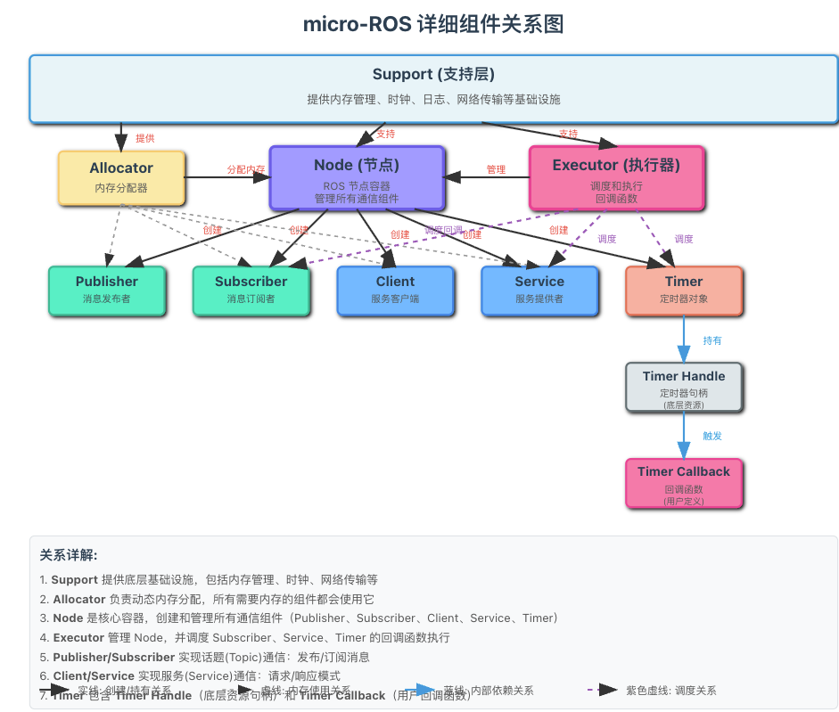
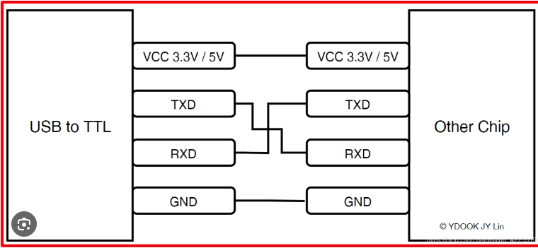
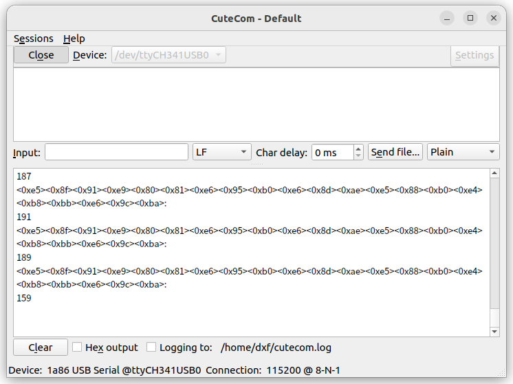
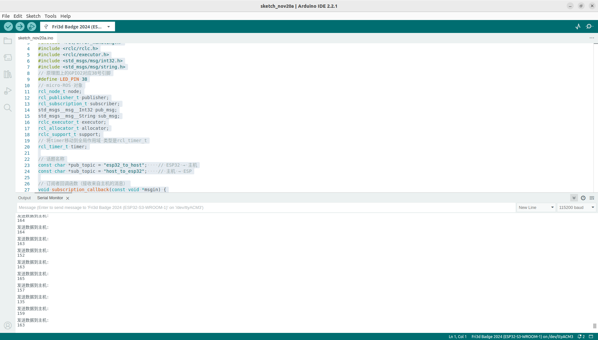

# 这次我们要通过ROS2主机来实现对下位寄存器的开发
## 首先我们先做最简单的GPIO模块，这里我是使用一个简单的LED灯来做演示，相关文件放在micro_ros3目录下Arduino.cpp,和相关py文件
首先我们需要看ESP32的引脚图文件/home/dxf/Desktop/li/参考文件/micro_ros3/引脚图/1.pdf
找到我们要操作的引脚，这里我选择的是GPIO2引脚,可以看出GPIO2引脚对应的是 38号引脚,给小灯设置成下拉模式
## 下面开始编写Arduino.cpp文件参考资料
### 参考下图的关系来初始化详Arduino.cpp模块
mirco_ros2中的需要额外初始化的模块有:
allcoator,support,executor,node,publisher,subscripition,client,service,timer,timer_handle,timer_callback等模块

通过这个图,我们可以看到这个的基石是support和allocator
初始化的时候需要先初始化这个两个模块
``` cpp
allocator = rcl_get_default_allocator();
rclc_support_init(&support, 0,NULL,&allocator);
```
之后创建node,因为time,subscription,client,server,publisher都是建立在节点上的
``` cpp
rclc_node_init_default(&node, "esp32_node", "", &support);
```
之后创建发布者和订阅者
``` cpp
    rclc_publisher_init_default(
    &publisher,
    &node,
    ROSIDL_GET_MSG_TYPE_SUPPORT(std_msgs, msg, Int32),
    pub_topic);
    rclc_subscription_init_default(
    &subscriber,
    &node,
    ROSIDL_GET_MSG_TYPE_SUPPORT(std_msgs, msg, String),
    sub_topic);
    // 初始化消息
    std_msgs__msg__Int32__init(&pub_msg);
    std_msgs__msg__String__init(&sub_msg);
```
之后需要创建执行器
```cpp
    // 创建执行器
    rclc_executor_init(&executor, &support.context, 2, &allocator);
    // 添加订阅者到执行器
    rclc_executor_add_subscription(&executor, &subscriber, &sub_msg, &sub_queue, &sub_callback);
```
这里有一个sub_callback函数
```cpp
void subscripition_callback(const void *msgin){
    const std_msgs__msg__String *msg = (const std_msgs__msg__String *)msgin;
    Serial.print("收到主机消息: ");
    Serial.println(msg->data.data);
    //收到主机信号来进行处理LED灯
    if(strstr(msg->data.data, "led_on")!=NULL){
        digitalWrite(LED_PIN,LOW);
        Serial.println("LED 已打开");
    }
    else if(strstr(msg->data.data, "led_off")!=NULL){
        digitalWrite(LED_PIN, HIGH);
        Serial.println("LED 已关闭");
    }
}
之后创建定时器
```cpp
    // 创建定时器（每2秒发送一次数据）
    rclc_timer_init_default(&timer, &support, RCL_MS_TO_NS(2000), timer_callback);
    rclc_executor_add_timer(&executor, &timer);
```
看到这参数timer_callback()函数,这个函数就是定时器回调函数,这个函数会定时执行,每次执行器执行的时候会调用pub_callback()函数,这个函数就是发布数据的函数
```cpp
void timer_callback(rcl_timer_t * timer, int64_t last_call_time){
    (void)last_call_time;
    if (timer != NULL) {
        // 发送传感器数据（示例：模拟读取）
        // 从原理图上看到ADC0是1号引脚,这里读取1号引脚的电压值
        pub_msg.data = analogRead(A0);
        // 发布消息
        rcl_ret_t ret = rcl_publish(&publisher, &pub_msg, NULL);
        // 检测是否发布成功
        if (ret == RCL_RET_OK) {
            Serial.print("发送数据到主机: ");
            Serial.println(pub_msg.data);
        } else {
            Serial.print("发布失败，错误码: ");
            Serial.println(ret);
        }
    }
}
```
## 编写host_bridge_node.py文件,其实可以和上次的相同,因为这个ROS就是和esp32进行通信的节点不需要更改了,能少改就少改原则.
```python
#!/usr/bin/env python3
import rclpy
from rclpy.node import Node
from std_msgs.msg import Int32, String
import threading
import time

class HostBridge(Node):
    def __init__(self):
        super().__init__('host_bridge')
        
        # 订阅来自 ESP32 的消息
        self.esp32_sub = self.create_subscription(
            Int32,
            'esp32_to_host',
            self.esp32_callback,
            10)
        
        # 发布到 ESP32 的消息
        self.host_pub = self.create_publisher(
            String,
            'host_to_esp32',
            10)
        
        # 启动发送线程
        self.send_thread = threading.Thread(target=self.send_commands)
        self.send_thread.daemon = True
        self.send_thread.start()
        
        self.get_logger().info('主机桥接节点已启动')
    
    def esp32_callback(self, msg):
        # 处理来自 ESP32 的数据
        self.get_logger().info(f'收到 ESP32 传感器数据: {msg.data}')
        
        # 根据数据做出响应（示例）
        if msg.data > 2000:
            response_msg = String()
            response_msg.data = "数据过高!"
            self.host_pub.publish(response_msg)
    
    def send_commands(self):
        """定期发送命令到 ESP32"""
        command_count = 0
        while rclpy.ok():
            time.sleep(5)  # 每5秒发送一次
            
            msg = String()
            if command_count % 2 == 0:
                msg.data = "LED_ON"
            else:
                msg.data = "LED_OFF"
            
            self.host_pub.publish(msg)
            self.get_logger().info(f'发送命令到 ESP32: {msg.data}')
            command_count += 1

def main():
    rclpy.init()
    node = HostBridge()
    
    try:
        rclpy.spin(node)
    except KeyboardInterrupt:
        pass
    finally:
        node.destroy_node()
        rclpy.shutdown()

if __name__ == '__main__':
    main()
```
## 把代码下载到ESP32中常见问题转到micro_ros.md这个介绍了下载出现的常见非编码错误
## 将上面的代码中的Serial换成为Serial0,
<https://docs.arduino.cc/tutorials/nano-esp32/cheat-sheet/#usb-serial--uart>
从上面的链接中可以看到我们的Serial0对应的我们的数据的收发引脚
使用串口助手加 ttl转串口工具来检测串口

ttl-usb 接线图



## 在Ubuntu上打开cutecom也就是串口助手


出现下面的数据证明已经通过串口来进行数据的收发啦
当然这个也可以将这个 TTS 转USB模块连接到其他电脑上，因为串口是在一直发送数据的，应该也可以检测到
这个串口助手输出的并不明显，可以使用 arduino 自带的串口工具


从这个上面就可以看到串口发送的数据


