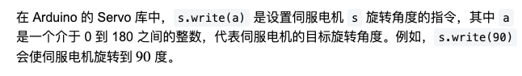
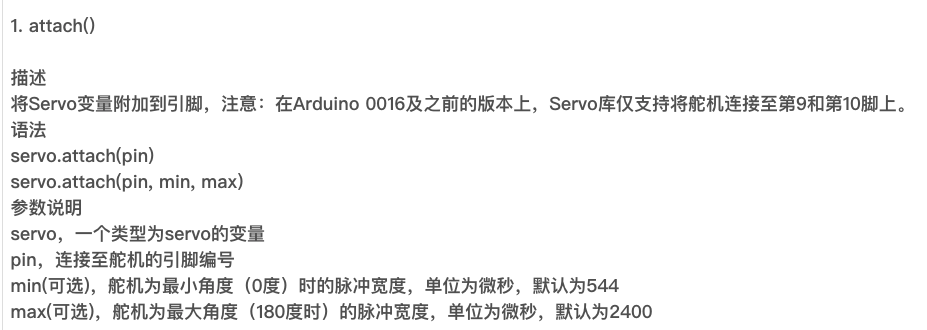
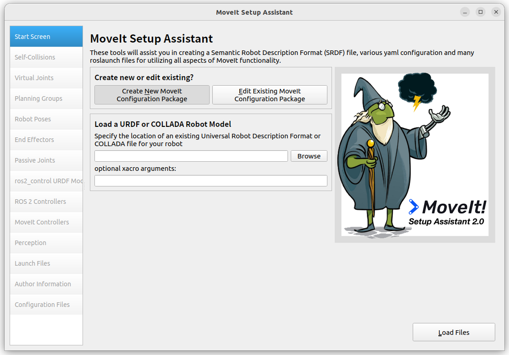

# 在上个文件中我们已经完成了对串口的读取，下一步就是对通过ESP32来控制机械臂了，
## 判断怎么控制机械臂
看机械臂引出的线，可以知道我们的是PWM舵机。
在 Arduino上找一个相关的控制舵机的 demo。因为这个舵机集线器上是一个ATMEGA168PA这个微控制器
需要在 preferences中添加<https://mcudude.github.io/MiniCore/package_MCUdude_MiniCore_index.json>

在 Arduino IDE中选择相应开发版器，然后下载对应开发板的代码，并上传到开发板中。可以使用下述代码，来控制电机运动
注此代码支持AVR架构的处理器，不支持ESP32，这段代码就是为了测试集线板是否正常工作,发现在 Ubuntu 下没有找到这个 USB 连接，🤦‍♂️
```cpp
// 包含舵机的头文件
#include <Servo.h>
// 新建 6 个舵机对象
Servo s1,s2,s3,s4,s5,s6;
// 最大最小脉冲范围
int minpulse=500;
int maxpulse=2500;
void setup(){
    // 初始化让这些舵机脉调整范围
    s1.attach(3,minpulse,maxpulse);
    s2.attach(5,minpulse,maxpulse);
    s3.attach(6,minpulse,maxpulse);
    s4.attach(9,minpulse,maxpulse);
    s5.attach(10, minpulse, maxpulse);
    s6.attach(11, minpulse, maxpulse);
    // 等待舵机初始化完成
    delay(1000);
}
// 控制 6 个舵机的参数,在 arduino 的 servo 库里面这些参数代表这个轴转多少度
void moveArm(int a,int b,int c,int d, int e ,int f){
    s1.write(a);
    s2.write(b);
    s3.write(c);        
    s4.write(d);
    s5.write(e);
    s6.write(f);
}
void loop(){
    // 让六个轴依次摆动
    moveArm(30,40,60,20,50,70);
    delay(1500);
    moveArm(90, 80, 120, 60, 90, 30);
    delay(1500);
    moveArm(150, 40, 100, 120, 60, 150);
    delay(1500);
    moveArm(90, 90, 90, 90, 90, 90);
    delay(1500);
}
```
下面是对本代码中的函数的解释


在 esp32 控制舵机 arduino 提供给我们的是<ESP32Servo.h> 
用法和上面差不多，源码我放在了./mirco_ros4/ESP32Servo.cpp下
前面提到架构问题 这里插一嘴：esp32 是Xtensa架构和 stm32 的 arm 架构arduino 的架构avr 架构不一样，注这里的 serial0 是我们专门接 ttl 转接 usb 的用来监测的串口
```cpp
// ESP32版本舵机控制+与 micro_ros通信
#include <ESP32Servo.h>
// 下面的可以参考上次写的 Ardunio.cpp文件
#include <mircro_ros_arduino.h>
#include <rcl/rcl.h>
#include <rclc/rclc.h>
#include <rclc/executor.h>
#include <rcl/error_handling.h>
#include <std_msgs/msg/string.h>
#include <std_msgs/msg/int32.h>
// 创建舵机对象
Servo s1,s2,s3,s4,s5,s6;
// 创建 support 对象
rcl_support_t support;
// 创建 allocator 对象
rcl_allocator_t allocator;
// 创建节点对象
rcl_node_t node;
// 创建 executor 对象--只有这个在 rclc 库中
rclc_executor_t executor;
// 创建 publisher 对象
rcl_publisher_t publisher;
// 创建 subscriber 对象
rcl_subscription_t subscriber;
// 创建 timer 对象
rcl_timer_t timer;
// 创建消息对象
// 因为 esp32 给主机发送的是 int32 类型的消息，所以这里创建 int32 类型的消息对象，A(0)的模拟量
std_msgs__msg__Int32 pub_msg;
// 因为主机给 esp32 发送的是LED_ON|LED_OFF，所以这里创建 String 
std_msgs__msg__String sub_msg;
// 话题名称
const char * topic = "esp32_to_host";
const char * node_name = "host_to_esp32";
void subscription_callback(const void *msgin) {
    const std_msgs__msg__String *msg = (const std_msgs__msg__String *)msgin;
    Serial0.print("收到主机消息: ");
    //Serial.print("收到主机消息: ");
    Serial0.println(msg->data.data);
    //Serial.println(msg->data.data);
    // 根据接收到的消息执行相应操作
    if (strstr(msg->data.data, "LED_ON") != NULL) {
        // 因为设置的是下拉模式,所以要设置为LOW才会点亮LED
        digitalWrite(LED_PIN, LOW);
        Serial0.println("LED 已打开");
        //Serial.println("LED 已打开");
    } else if (strstr(msg->data.data, "LED_OFF") != NULL){
        digitalWrite(LED_PIN, HIGH);
        Serial0.println("LED 已关闭");
        //Serial.println("LED已关闭");
    }
}
void timer_callback(rcl_timer_t *timer, int64_t last_call_time) {
    (void)last_call_time;
    if (timer != NULL) {
        // 发送传感器数据（示例：模拟读取）
        // A0从原理图上读出
        pub_msg.data = analogRead(A0);

        // 发布消息
        rcl_ret_t ret = rcl_publish(&publisher, &pub_msg, NULL);
        if (ret == RCL_RET_OK) {
            // 使用另一个串口Serial0.print(),
            // 从这个网址上了解到https://docs.arduino.cc/tutorials/nano-esp32/cheat-sheet/#usb-serial--uart
            // 是发送和接收引脚
            Serial0.println("发送数据到主机: ");
            //Serial.print("发送数据到主机: ");
            Serial0.println(pub_msg.data);
            //Serial.println(pub_msg.data);

        } else {
            Serial0.print("发布失败，错误码: ");
            //Serial.print("发布失败，错误码: ");
            Serial0.println(ret);
            //Serial.println(ret);
        }
    }
}

//设置最大和最小的脉冲范围
int minpulse = 500;
int maxpulse = 2500;
// 这里的引脚要看集线器和我们的 esp32 的连接情况，按需修改
void setup() { 
    // 初始化六个舵机
    s1.attach(18,minpulse,maxpulse);
    s2.attach(19,minpulse,maxpulse);
    s3.attach(21,minpulse,maxpulse);
    s4.attach(22,minpulse,maxpulse);
    s5.attach(23,minpulse,maxpulse);
    s6.attach(25,minpulse,maxpulse);
    delay(1000);
    // 设置小灯初始模式为输出模式,并设置为下拉模式,根据我们外围电路决定
    // 类似于STM32的GPIO初始化
    pinMode(LED_PIN, OUTPUT);
    // 设置ADC0引脚为输入模式   
    pinMode(A0, INPUT);
    // 初始化串口Serial和Serial0
    Serial.begin(115200);
    Serial0.begin(115200);

    digitalWrite(LED_PIN, HIGH); // 初始化时关闭LED
    set_microros_wifi_transports("WHEELTEC_S300", "dongguan", "192.168.0.100", 8888);
    delay(2000);  // 等待连接建立
    // 初始化 micro-ROS 支持结构
    allocator = rcl_get_default_allocator();
    rclc_support_init(&support, 0, NULL, &allocator);
    // 创建节点
    rclc_node_init_default(&node, "esp32_node", "", &support);
    // 创建发布者
    rclc_publisher_init_default(
        &publisher,
        &node,
        ROSIDL_GET_MSG_TYPE_SUPPORT(std_msgs, msg, Int32),
        pub_topic);
    // 创建订阅者
    rclc_subscription_init_default(
        &subscriber,
        &node,
        ROSIDL_GET_MSG_TYPE_SUPPORT(std_msgs, msg, String),
        sub_topic);
    // 初始化消息
    std_msgs__msg__Int32__init(&pub_msg);
    std_msgs__msg__String__init(&sub_msg);
    // 创建执行器
    rclc_executor_init(&executor, &support.context, 2, &allocator);
    // 添加订阅者和定时器到执行器
    rclc_executor_add_subscription(
        &executor,
        &subscriber,
        &sub_msg,
        &subscription_callback,
        ON_NEW_DATA);
    // 创建定时器
    rclc_timer_init_default(
        &timer,
        &support,
        RCL_MS_TO_NS(1000),
        timer_callback);
    rclc_executor_add_timer(&executor, &timer);
    Serial0.println("ESP32 micro-ROS 双向通信初始化完成!");
    // Serial.println("ESP32 micro-ROS 双向通信初始化完成!");


}
// 控制 6 个舵机的参数,在 arduino 的 servo 库里面这些参数代表这个轴转多少度
void moveArm(int a,int b,int c,int d, int e ,int f){
    s1.write(a);
    s2.write(b);
    s3.write(c);        
    s4.write(d);
    s5.write(e);
    s6.write(f);
}
// 这里旋转角度是一个显示的例子，按需更改，单位是角度，可以参考上一个写的示例
void loop(){
    // 让六个轴依次摆动
    moveArm(30,40,60,20,50,70);
    delay(1500);
    moveArm(90, 80, 120, 60, 90, 30);
    delay(1500);
    moveArm(150, 40, 100, 120, 60, 150);
    delay(1500);
    moveArm(90, 90, 90, 90, 90, 90);
    delay(1500);
    rclc_executor_spin_some(&executor, RCL_MS_TO_NS(100));
    delay(10);
}
```
可以看到需要修改头文件，就可以啦！
这里因为我们的下载不到这个 atmega168 上面好像是因为电压不够
出现问题：
<b><font color="red">ketch uses 2466 bytes (15%) of program storage space. Maximum is 16000 bytes. Global variables use 65 bytes (6%) of dynamic memory, leaving 959 bytes for local variables. Maximum is 1024 bytes. Warning: attempt 1 of 10: not in sync Warning: attempt 2 of 10: not in sync Warning: attempt 3 of 10: not in sync Warning: attempt 4 of 10: not in sync Warning: attempt 5 of 10: not in sync Warning: attempt 6 of 10: not in sync Warning: attempt 7 of 10: not in sync Warning: attempt 8 of 10: not in sync Warning: attempt 9 of 10: not in sync Warning: attempt 10 of 10: not in sync</font></b>
于是我只可以购买一个集线器来实现通信了，下面展示我自己的一个流程图设计思路

``` mermaid

graph LR
    A[ROS2(实现路径规划Moevit2)]-->|micro_ros_agent|B[ESP32]
    B[ESP32]-->|集线器|[舵机运动]

```

### 从上图中我们了解了各部分的分工,因为我们集线器还没有到所以今天主要是在进行ROS2的运动规划
#### 准备urdf文件

```bash
cd ~/Desktop/li
mkdir -p li_ros2/src
cd li_ros2/src
ros2 pkg create --build-type ament_cmake robot_descripiton
cd robot_descripiton
mkdir -p urdf
touch urdf/robot.urdf
```
下面开始编写这个urdf，根据这个模型编写，建议下载 urdf.viewer 来查看模型(近似)
因为本机械臂并没有给我们提供 stl 文件，如果 提供我们可以直接导入，当然我们可以使用 solidworker 来生成相应的文件（更精准）
所以在网上找一个 stl /obj文件
<https://github.com/PCrnjak/Faze4-Robotic-arm/tree/master>
注：通过 git 克隆的项目都在Downloads 文件夹下，个人习惯
把里面的 URDF_FAZE4放在 src 目录下

```bash
# 这个命名很奇怪在上层命名的是URDF_FAZE4在 package 里面命名的是Final_light_assembly_URDF🤦‍♂️
colcon build --packages-select Final_light_assembly_URDF
# 发现是ros1的urdf文件🤦‍♂️，那只可以在找一个 ros2 的 urdf 文档
```
再克隆一个其他的仓库参考连接<https://zhuanlan.zhihu.com/p/1920253906883187153>

```bash
# 安装franka_description描述包-ros-humble 版本的，当然我们也可以自己写一个自己的 urdf 包
sudo apt install ros-humble-franka-description
cd ~/Desktop/li
mkdir -p moveit_ws/src
ros2 launch moveit_setup_assistant setup_assistant.launch.py
```
会显示这个界面选择 create New Moveit

一般通过 apt 安装的 ros 包在/opt/ros/humble/share下
选择这个路径
但是不知道他让我们下载的这个包下并没有 urdf 文件,只有 xraco 文件


