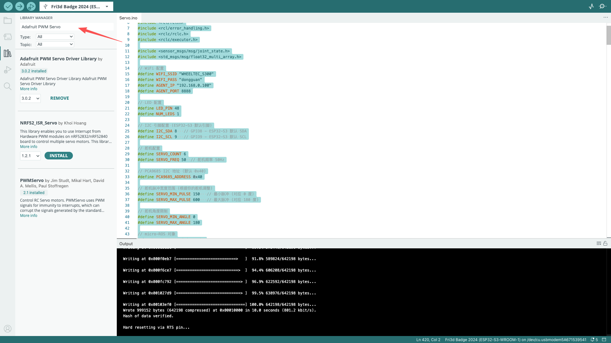

# 这里我通过6路舵机模块来进行机械臂的操作
## 1.阅读ESP32-S3-WROOM-1的数据手册
因为这里的舵机驱动模块是和 ESP32-S3-WROOM-1 问商家商家给我说 IIC 的数据线是
SDA 对应的是 引脚 8和 SCL 对应的是引脚 9
下面开始编写我们的舵机控制程序[Arduinoservo.ino](./micro_ros5/ArduinoServo.ino)
在Arduino 应用程序里面添加下面的那个库文件
Adafruit PWM Servo

然后进行下载就可以啦
## 在 Ubuntu 22.04上打开 micro_ros_agent来连接这个 ESP32 模块

```bash
    cd ~/Desktop/li/micro_ros_ws
    source ./install/setup.bash
    ros2 run micro_ros_agent micro_ros_agent udp4 --port 8888
```
然后新建一个终端给 ESP32发信息

```bash
    # 发送指令给机械臂
    ros2 topic pub /servo_angles std_msgs/msg/Float32MultiArray "{data: [90.0, 45.0, 135.0, 60.0, 120.0, 90.0]}" --once
ros2 topic pub /servo_angles std_msgs/msg/Float32MultiArray"{data: [90.0, 45.0, 135.0, 60.0, 120.0, 90.0]}" --once

```
### 问题出现
当我们运行这个指令的时候发现舵机并没有运动,观察串口发现串口没有输出🤦‍♂️
[serial](./SerialNoOutput.md)看这个文章，并调整 ESP32 中的设置就可以啦
这样我们就可以在串口里面出现完整输出啦

### 1.检测消息是否到达 ESP32
```bash
ros2 topic info /servo_angles -v
```
终端输出如下
<font color="yellow">dxf@ubuntu:~/Desktop/li$ ros2 topic info /servo_angles -v
Type: std_msgs/msg/Float32MultiArray

Publisher count: 0

Subscription count: 1

Node name: servo_controller_node
Node namespace: /
Topic type: std_msgs/msg/Float32MultiArray
Endpoint type: SUBSCRIPTION
GID: 01.0f.02.0a.e5.26.d3.e8.00.00.00.00.00.00.02.04.00.00.00.00.00.00.00.00
QoS profile:
  Reliability: RELIABLE
  History (Depth): UNKNOWN
  Durability: VOLATILE
  Lifespan: Infinite
  Deadline: Infinite
  Liveliness: AUTOMATIC
  Liveliness lease duration: Infinite</font>
证明和 esp32 的通信正常
## 2.测试关节是否正常
```bash
  ros2 topic echo /joint_states --once
```
<font color ="red">
header:
  stamp:
    sec: 0
    nanosec: 0
  frame_id: ''
name:
- "���?\x14"
- "`��?Z�\bB\x04"
- l3
- ''
- "\x01"
- ���?Ƕ
position:
- 1.5707963267948966
- 1.5707963267948966
- 1.5707963267948966
- 1.5707963267948966
- 1.5707963267948966
- 1.5707963267948966
velocity: []
effort: []
---</font>
这个问题是因为我们的


### 调试指令
#### 1.检测各个关节的状态
```bash
ros2 topic echo /joint_states --once
```
