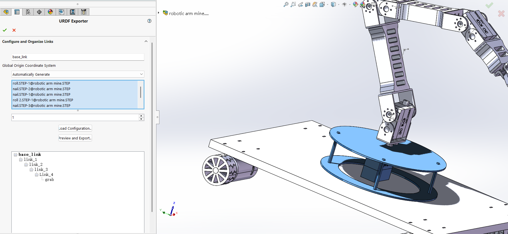
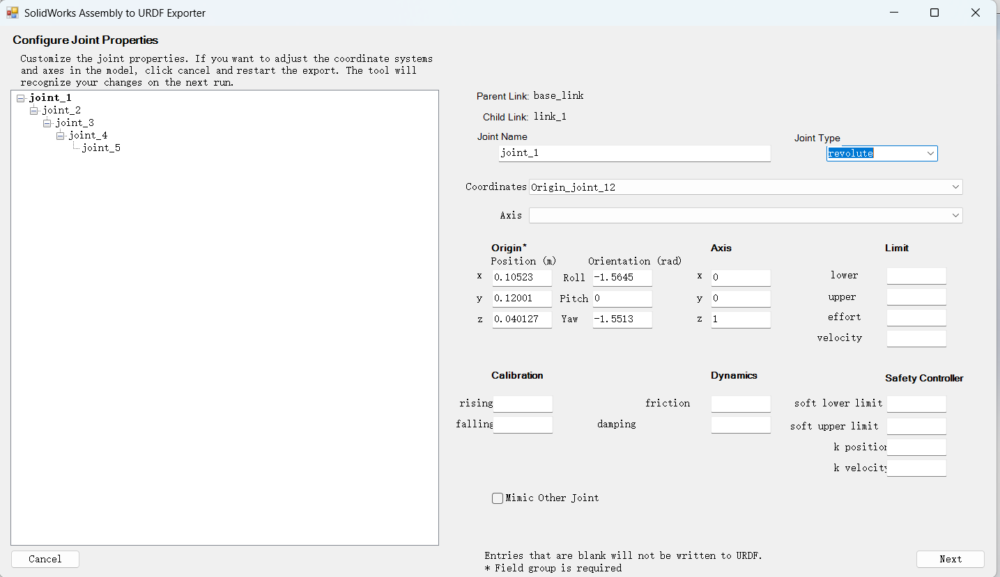

# 下面可以来使用moveit来进行运动规划了
具体实现可以参考这个demo<https://github.com/heisd/RosReference/blob/liquanyan/moveit1.md>
下面是厂家并没有提供给我们相关的urdf模型
这里我是用AI通过我拍的照片来给我建一个模型
## 首先需要一个urdf文件,需要厂商提供给我们一个包
注：厂家并没有给我们提供包，这个机械臂是很早以前买的
下面介绍，如果没有现成的urdf文件，我们应该怎么做
### 1.进入网站
<https://grabcad.com/>,进入这个网站，可以下载现成的step文件
### 2.找和我们机械臂很像的机械臂
这里我找了一个和我们的机械臂很像的文件
<https://grabcad.com/library/5-dof-robotic-arm-14>
这个文件除了比我们的文件多了一个底盘下面有四个伺服电机，其他的和我们的很相似，在特别是在机械结构上
### 3.在solidwork上找一个可以转换成urdf的插件
并且solidwork给我们提供了丰富的插件系统，其中有一个就叫export as urdf的插件</br>
插件下载地址
<https://github.com/ros/solidworks_urdf_exporter/releases>
下载.exe的文件，并安装
### 4.使用这个插件，在工具->tools->export_as_urdf里面
#### 1.选择base_link


#### 2.add 子关节
右击那个base_link,设置add 子关节，选择子关节的名称和joint的名称，重复这个操作到我们的机械臂被完全给选中完成
- 关于舵机的归属问题，这个舵机相对于哪一个关节是静止的，我的舵机就是在哪一个关节上面
#### 3.preview and export
##### 1.设置joint的状态
###### 1.关节的设置
注意夹爪和那个不是很一样，现在先不设置夹爪的情况

- joint type 设置成为 revolute 旋转的
- axis 绕哪一个轴旋转，哪一个设置成为1，其他的设置成为0
- limit 
根据机械结构决定，先设置成为(-90°~90°)
lower -1.57</br>
upper 1.57</br>
根据舵机参数决定，这里使用的舵机是LD_1501MG舵机
参数如下
舵机的最大力矩
effort 17<br>
舵机的最大速度
veiocity 6.0
###### 2.夹爪的设置
- joint type 设置成为 Revolute
- axis 绕哪一个轴旋转，哪一个设置成为1，其他的设置成为0
- limit 
根据机械结构决定,只可以设置成为（0°~90°）
lower 0</br>
upper 1.57</br>
舵机的最大力矩
effort 17<br>
舵机的最大速度，防止张开的太快
veiocity 1

完成之后点击next，接着点击export URDF and Meshes 或者直接生成urdf也行，只是不如第一种

### 5.将生成的urdf放在我们的ros2_ws/src的目录下
```bash
    colcon build --symlink-install
```
注意这里导出的文件是ROS1的urdf文件，可以使用Gemini把ROS1的文件内容修改成为ROS2的文件内容

## 运行moveit工具来使得我们的urdf文件可以被moveit识别
注意这个要在主机上运行或者使用MobaXterm软件来使用
```bash
ros2 run moveit_setup_assistant moveit_setup_assistant
```
出现这个问题
```bash
dxf@ubuntu:~/Desktop/li/ros2_ws$ ros2 run moveit_setup_assistant setup_assistant
No executable found
```
安装moveit-setup-assisant
```bash
sudo apt install ros-humble-moveit-setup-assistant
```
再运行
下面可以参考这个的配置<https://github.com/heisd/RosReference/blob/liquanyan/moveit1.md>
并将文件存放在moveit_ws/src/micro_urdf下面
编译
```bash
colcon build --symlink-install
```
运行我们生成的launch文件
```bash
ros2 launch mirco_urdf demo.launch.py
```


