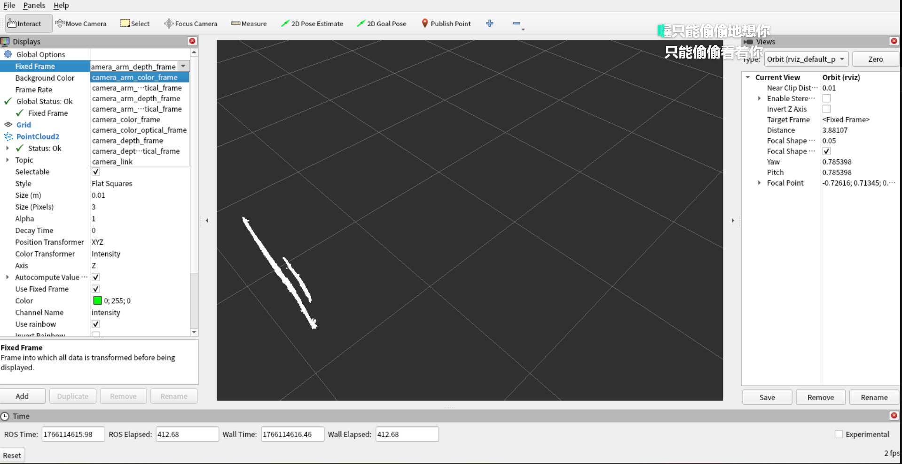

# 这个讲的是我们怎么获取点云数据
## 方式一：通过深度相机来获取
查看我们深度相机的型号Orbbec Gemini pro
### 1.安装对应驱动
### 2.检查相机是否可以被识别
```bash
    ros2 run orbbec_camera list_devices_node
```
### 3.这个在ROS2的包目录下，看这个运行文件点云数据是默认开启的 
```bash
    ros2 launch orbbec_camera ob_camera.launch.py 
```
运行这个出现带宽不足的情况，我们现检测一下我们这个电脑上有没有USB 3.0
```bash
# 检查usb连接情况
lsusb -t 
```
输出如下
```bash
/:  Bus 02.Port 1: Dev 1, Class=root_hub, Driver=tegra-xusb/4p, 10000M
/:  Bus 01.Port 1: Dev 1, Class=root_hub, Driver=tegra-xusb/4p, 480M
    |__ Port 2: Dev 2, If 0, Class=Hub, Driver=hub/4p, 480M
        |__ Port 1: Dev 3, If 0, Class=Human Interface Device, Driver=usbhid, 12M
        |__ Port 2: Dev 4, If 0, Class=Hub, Driver=hub/4p, 480M
            |__ Port 4: Dev 16, If 0, Class=Hub, Driver=hub/2p, 480M
                |__ Port 2: Dev 18, If 0, Class=Vendor Specific Class, Driver=, 480M
                |__ Port 1: Dev 17, If 0, Class=Video, Driver=uvcvideo, 480M
                |__ Port 1: Dev 17, If 1, Class=Video, Driver=uvcvideo, 480M
            |__ Port 2: Dev 6, If 0, Class=Hub, Driver=hub/4p, 480M
                |__ Port 3: Dev 10, If 0, Class=Hub, Driver=hub/4p, 480M
                    |__ Port 3: Dev 12, If 0, Class=Communications, Driver=cdc_acm, 12M
                    |__ Port 3: Dev 12, If 1, Class=CDC Data, Driver=cdc_acm, 12M
                    |__ Port 4: Dev 13, If 0, Class=Hub, Driver=hub/2p, 480M
                        |__ Port 1: Dev 14, If 1, Class=Video, Driver=, 480M
                        |__ Port 1: Dev 14, If 0, Class=Video, Driver=, 480M
                        |__ Port 2: Dev 15, If 0, Class=Vendor Specific Class, Driver=, 480M
                |__ Port 1: Dev 8, If 1, Class=CDC Data, Driver=cdc_acm, 12M
                |__ Port 1: Dev 8, If 0, Class=Communications, Driver=cdc_acm, 12M
        |__ Port 3: Dev 5, If 0, Class=Communications, Driver=cdc_acm, 12M
        |__ Port 3: Dev 5, If 1, Class=CDC Data, Driver=cdc_acm, 12M
```
证明只有一个BUS 02.Port 是USB 3.0的接口
试试使用低带宽的解决方案
```bash
ros2 launch orbbec_camera ob_camera.launch.py \
    depth_width:=320 \
    depth_height:=240 \
    depth_fps:=10 \
    color_width:=320 \
    color_height:=240 \
    color_fps:=10 \
    # 禁用红外图像
    enable_ir:=false
```
发现还是不行
检测驱动不知道为啥底层不行而轮趣他们写的包可以做到
### 4.轮趣官方给我说他们写的一个功能包，叫astra_camera里面的一个功能包，看一下这个包都实现了什么
```bash
    ros2 launch astra_camera gemini_arm.launch.py
    # 启动rviz来观察坐标系
    rviz2 
    # 注意fix frame 要设置成 camera_arm_depth_frame 
    # 添加point cloud 数据源
```


### 5.这就很奇怪了，底层驱动不支持，我们运行轮趣的包，它居然支持
我们来看一下这是怎么实现的吧
参数如下
看gemini_arm.launch.py是通过gemini_arm.launch.xml来实现的
```xml
<arg name="depth_registration" default="true"/>
    <arg name="serial_number" default="AY2M543004C"/>     
    <arg name="device_num" default="1"/>
    <arg name="vendor_id" default="0x2bc5"/>
    <arg name="product_id" default=""/>
    <arg name="enable_point_cloud" default="true"/>
    <arg name="enable_colored_point_cloud" default="false"/>
    <arg name="point_cloud_qos" default="default"/>
    <arg name="connection_delay" default="100"/>
    <arg name="color_width" default="640"/>
    <arg name="color_height" default="480"/>
    <arg name="color_fps" default="30"/>
    <arg name="enable_color" default="true"/>
    <arg name="flip_color" default="false"/>
    <arg name="color_qos" default="default"/>
    <arg name="color_camera_info_qos" default="default"/>
    <arg name="depth_width" default="640"/>
    <arg name="depth_height" default="400"/>
    <arg name="depth_fps" default="30"/>
    <arg name="enable_depth" default="true"/>
    <arg name="flip_depth" default="false"/>
    <arg name="depth_qos" default="default"/>
    <arg name="depth_camera_info_qos" default="default"/>
    <arg name="ir_width" default="640"/>
    <arg name="ir_height" default="400"/>
    <arg name="ir_fps" default="30"/>
    <arg name="enable_ir" default="true"/>
    <arg name="flip_ir" default="false"/>
    <arg name="ir_qos" default="default"/>
    <arg name="ir_camera_info_qos" default="default"/>
    <arg name="publish_tf" default="true"/>
    <arg name="tf_publish_rate" default="10.0"/>
    <arg name="ir_info_url" default=""/>
    <arg name="color_info_url" default=""/>
    <arg name="color_roi_x" default="0"/>
    <arg name="color_roi_y" default="0"/>
    <arg name="color_roi_width" default="640"/>
    <arg name="color_roi_height" default="400"/>
    <arg name="depth_roi_x" default="-1"/>
    <arg name="depth_roi_y" default="-1"/>
    <arg name="depth_roi_width" default="-1"/>
    <arg name="depth_roi_height" default="-1"/>
    <arg name="depth_scale" default="1"/>
    <arg name="color_depth_synchronization" default="true"/>
    <arg name="use_uvc_camera" default="true"/>
    <arg name="uvc_vendor_id" default="0x2bc5"/>
    <arg name="uvc_product_id" default="0x0511"/>
    <arg name="uvc_retry_count" default="100"/>
    <arg name="uvc_camera_format" default="mjpeg"/>
    <arg name="uvc_flip" default="false"/>
    <arg name="oni_log_level" default="verbose"/>
    <arg name="oni_log_to_console" default="false"/>
    <arg name="oni_log_to_file" default="false"/>
    <arg name="enable_d2c_viewer" default="false"/>
    <arg name="enable_publish_extrinsic" default="false"/>
```
并且启动了astra_camera_node节点
可以找到这个源码在


## 方式二：通过激光雷达获取


